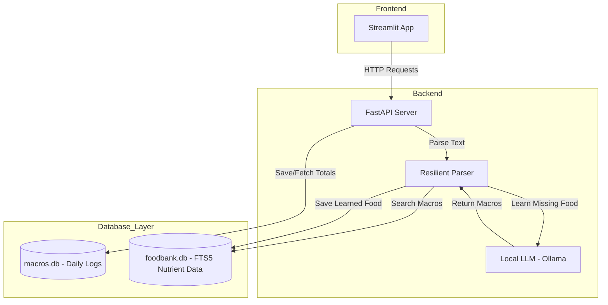

# 🥗 MacroManager

MacroManager is an AI-powered nutrition tracking system that deconstructs messy food logs into raw ingredients, fetches accurate macros from a local SQLite FTS5 database, and summarizes daily intake.

## 📐 System Architecture (HLD)



## 🚀 Features
- **LLM-powered Parsing**: Deconstructs complex meals (e.g., "Penne Alfredo") into base ingredients.
- **FTS5 Foodbank**: Fast, alias-based lookup for nutrient data.
- **Resilient Learning**: Automatically learns missing food macros from LLM and persists them.
- **Daily Dashboard**: Streamlit UI for tracking calories and macros.

## 🛠️ Installation
1. Install dependencies:
   ```bash
   pip install -r requirements.txt
   ```
2. Start the API server:
   ```bash
   python app/api.py
   ```
3. Run the frontend:
   ```bash
   streamlit run app/frontend.py
   ```

## 📂 Project Structure
- `app/`: Core logic (API, Database, Parser, Frontend).
- `scripts/`: Utility scripts (e.g., CSV ingestion).
- `tests/`: Integration and unit tests.
- `wiki/`: Project documentation and QA rules.

## ⚙️ Configuration
Ensure a local Ollama instance is running with `qwen2.5-coder:7b` on port 11434. All components are designed to work offline.
